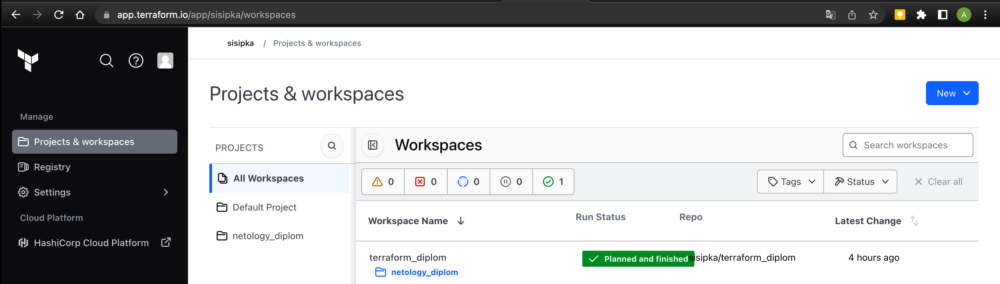
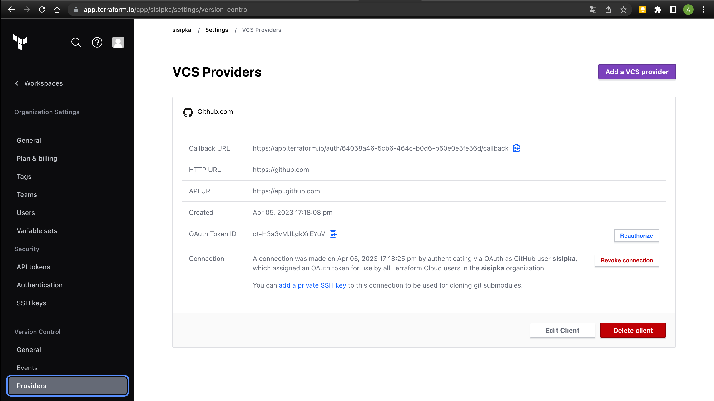
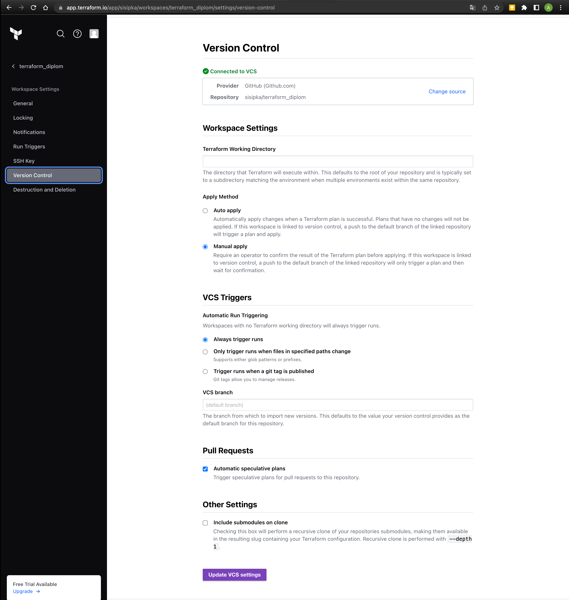
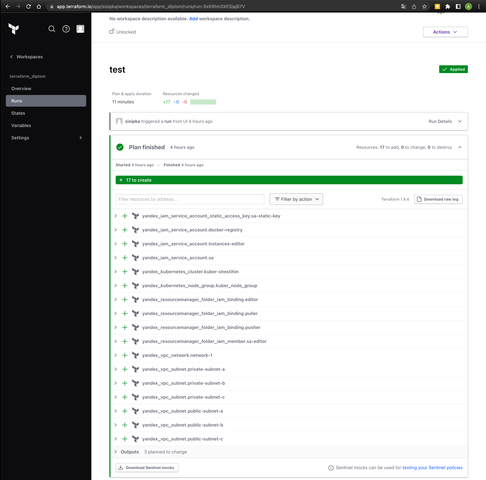
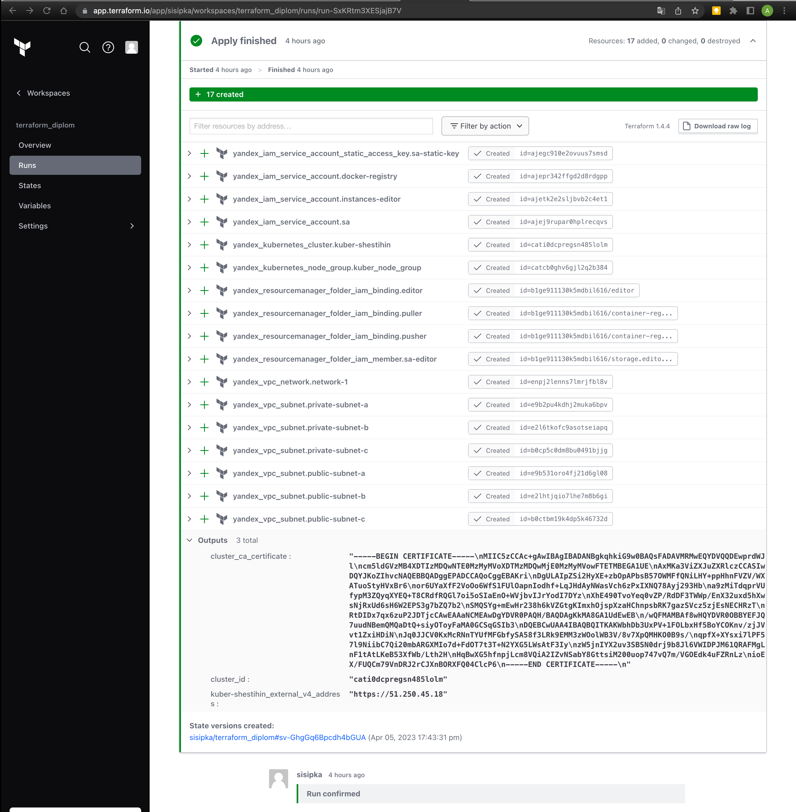

# terraform-diplom

## Настраиваем Terraform Cloud и Github для отслеживания изменений инфраструктуры :

1. Создаем учетную запись, project и workspace в Terraform Cloud:

  

  

  

2. Terraform plan & terraform apply:

  

  

